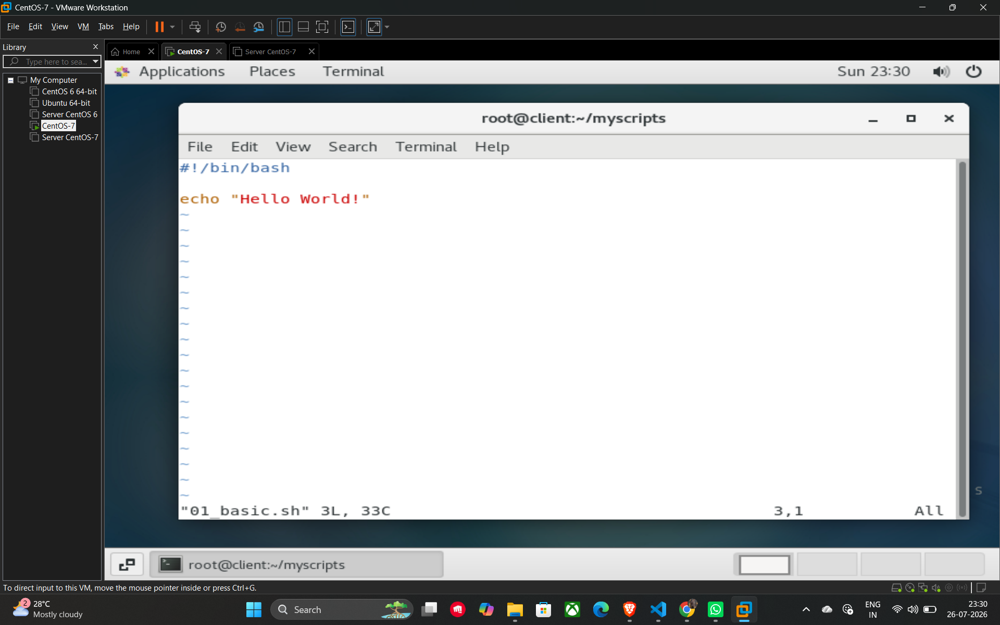

# Shell Scripting Essentials

This repository contains fundamental notes on **Linux Shell Scripting**, based on the introductory lecture for DevOps.

## 1. What is a Linux Shell?

A **Shell** provides an environment for a user to execute commands and interact with the **Kernel**. It acts as an intermediary layer between the user (via applications) and the operating system's core.

**System Architecture Layers:**

* **Hardware:** The physical machine.
* **Kernel:** Manages hardware resources.
* **Shell:** The interface to the kernel.
* **Applications:** Software running on top of the shell.

## 2. Types of Shells

There are several types of shells available in Linux environments:

* bash (Bourne Again SHell - most common)
* sh (Bourne Shell)
* ksh (Korn Shell)
* tsh (TENEX C Shell)
* fish (Friendly Interactive SHell)
* zsh (Z Shell)

**How to check your current shell type:** Run the following command in your terminal:

```bash
echo $0
```

## 3. What is Shell Scripting?

A shell script consists of a **set of commands** designed to perform a specific task.

* **Sequential Execution:** All commands in the script execute one after another.
* **Common Uses:** File manipulation, program execution, user interaction, and automation of repetitive tasks.

## 4. Writing Your First Script

To create a basic script, you define the interpreter and the commands to run.

### The Shebang (#!)

The first line of a script, known as the **Shebang**, tells the system which interpreter to use to execute the script.

* **Example:** `#!/bin/bash`

### Sending Output

Use the echo command to print text to the terminal.

**Example Script (01_basic.sh):**

```bash
#!/bin/bash
echo "Hello World!"
```

## 5. How to Run a Script

Before running a script, you must ensure it has the correct permissions and use the proper execution command.

### Step 1: Permissions

Make sure the script has **execute permission** (rwx). You can typically set this using `chmod +x script.sh`.

### Step 2: Execution Methods

You can run the script using any of these methods:

* Using a relative path: `./script.sh`
* Using an absolute path: `/path/to/script.sh`
* Specifying the shell directly: `bash script.sh`

### Useful Shortcuts

* **Ctrl+C**: Terminate a running script.
* **Ctrl+Z**: Stop (suspend) a running script.

## Example



