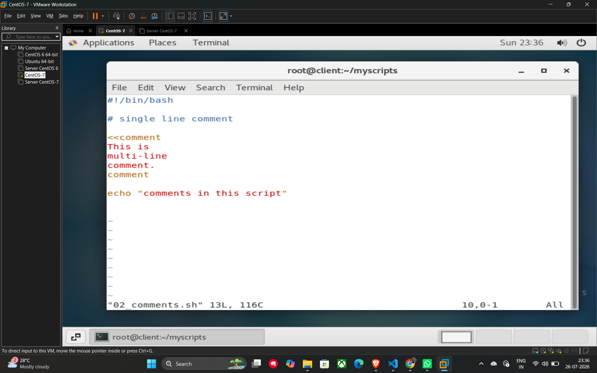

# Comments in Shell Scripting

Comments are used to explain the code and are ignored by the shell during execution. They are essential for making scripts readable and maintainable.

## Single-line Comments

To create a single-line comment, use the **#** symbol. Any text following the # on that line will not be executed.

**Example:**

```bash
# This is a single-line comment
echo "Hello World" # This comment is also valid
```

## Multi-line Comments

For commenting out multiple lines of text or code at once, you can use a "here document" style syntax. Start the block with **<<comment** and end it with **comment**.

**Example Script (02_comments.sh):**

```bash
#!/bin/bash

# This is a single line comment

<<comment
This is a
multi-line
comment.
comment

echo "comments in this script"
```

## Example


