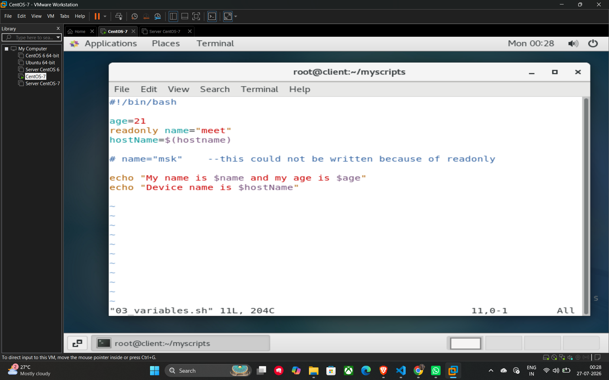

# Variables in Shell Scripting

Variables are used to store data that can be referenced and manipulated within a script.

## Defining and Using Variables

* **Syntax for assignment:** `VAR_NAME=value` (Note: No spaces around the `=` sign).
* **Accessing a variable:** Use the **$** symbol before the variable name.

**Example:**

```bash
age=21
echo "My age is $age"
```

## Storing Command Output in Variables

You can store the output of a Linux command into a variable using **Command Substitution**.

* **Syntax:** `VAR_NAME=$(command)`

**Example Script:**

```bash
hostName=$(hostname)
echo "Device name is $hostName"
```

## Constant Variables (Read-only)

If you want to define a variable whose value should **not change** throughout the execution of the script, you can make it a constant.

* **Keyword:** `readonly`
* **Behavior:** Once a variable is marked as readonly, any attempt to reassign or overwrite its value will result in an error.

**Example Script (03_variables.sh):**

```bash
#!/bin/bash

# Defining a regular variable
age=21

# Defining a constant variable
readonly name="meet"

# This assignment would fail because 'name' is readonly
# name="msk"

hostName=$(hostname)

echo "My name is $name and my age is $age"
echo "Device name is $hostName"
```

## Example


