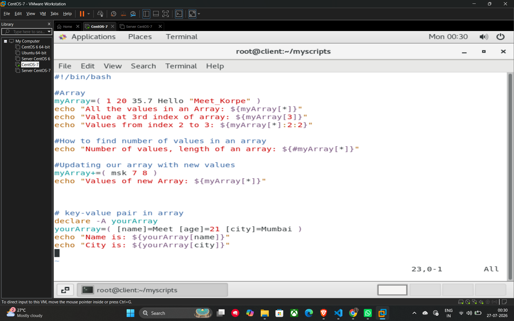

# Arrays in Shell Scripting

Arrays allow you to store multiple values, even of different data types (integers, strings, floats), in a single variable.

## Defining and Accessing Arrays

* **Define an Array:** Group values within parentheses, separated by spaces.
* `myArray=( 1 20 35.7 Hello "Meet_Korpe" )`
* **Access All Values:** Use `${myArray[*]}` to see every element.
* **Access a Specific Index:** Specify the index in brackets. Remember, indexing starts at 0.
* *Example:* `${myArray[3]}` retrieves the 4th value.

## Array Operations

* **Finding Length:** Use the `#` symbol before the array name to get the total number of elements.
* `echo "Number of values, length of an array: ${#myArray[*]}"`
* **Slicing (Range of Values):** Extract specific segments using `${myArray[*]:start:length}`
* *Example:* `${myArray[*]:2:2}` starts at index 2 and gets 2 values.
* **Updating an Array:** Use the `+=` operator to append new values to an existing array.
* `myArray+=( msk 7 8 )`

## Key-Value Pairs (Associative Arrays)

Associative arrays let you use strings as keys instead of numbers.

## Setup and Usage

* **Declaration:** You must use `declare -A` before using an associative array.
* **Assignment:** Define pairs using `[key]=value`.

**Example Script (04_array.sh):**

```bash
#!/bin/bash

# Array definition and basic access
myArray=( 1 20 35.7 Hello "Meet_Korpe" )
echo "All the values in an Array: ${myArray[*]}"
echo "Value at 3rd index of array: ${myArray[3]}"
echo "Values from index 2 to 3: ${myArray[*]:2:2}"

# Finding array length
echo "Number of values, length of an array: ${#myArray[*]}"

# Updating the array
myArray+=( msk 7 8 )
echo "Values of new Array: ${myArray[*]}"

# Key-value pair (Associative Array)
declare -A yourArray
yourArray=( [name]=Meet [age]=21 [city]=Mumbai )
echo "Name is: ${yourArray[name]}"
echo "City is: ${yourArray[city]}"
```

## Example


