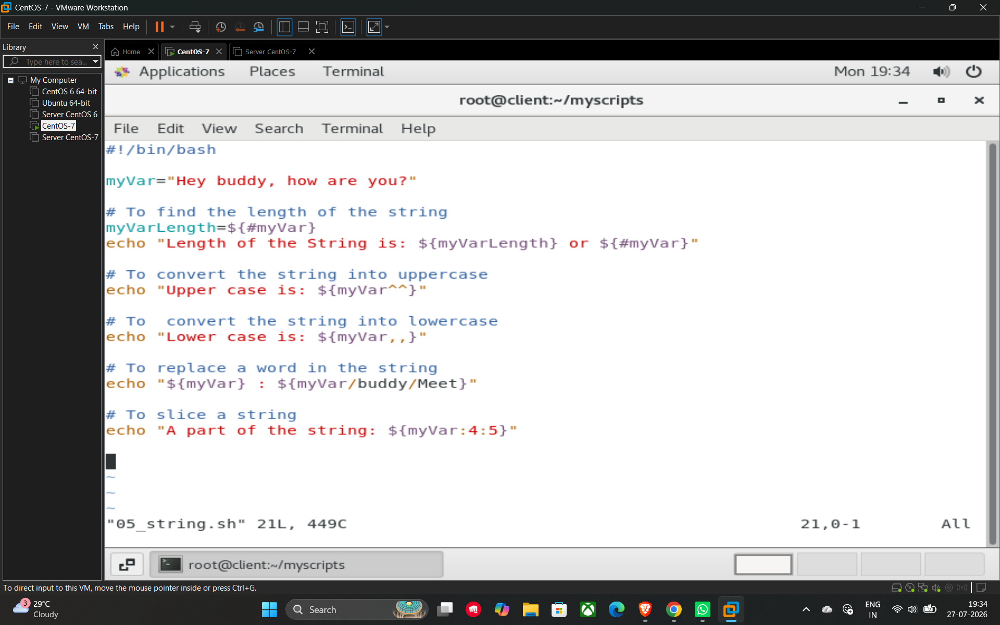

# String Operations

Shell scripting provides several built-in ways to manipulate and extract information from strings.

## Key Operations

* **Finding String Length:** Use the `${#variable_name}` syntax to get the total number of characters in a string.
* **Case Conversion:**
* **Uppercase:** `${variable_name^^}` converts the entire string to uppercase.
* **Lowercase:** `${variable_name,,}` converts the entire string to lowercase.
* **Replacing Text:** You can replace a specific word or pattern within a string using `${variable_name/old_word/new_word}`
* **String Slicing:** Extract a specific portion of a string using `${variable_name:offset:length}`, where offset is the starting index and length is the number of characters to extract.

## Example Script (05_string.sh)

This script demonstrates the string operations mentioned above:

```bash
#!/bin/bash

myVar="Hey buddy, how are you?"

# To find the length of the string
myVarLength=${#myVar}
echo "Length of the String is: ${myVarLength} or ${#myVar}"

# To convert the string into uppercase
echo "Upper case is: ${myVar^^}"

# To convert the string into lowercase
echo "Lower case is: ${myVar,,}"

# To replace a word in the string
# Replaces "buddy" with "Meet"
echo "${myVar} : ${myVar/buddy/Meet}"

# To slice a string
# Starts at index 4 and takes 5 characters
echo "A part of the string: ${myVar:4:5}"
```

## Example


