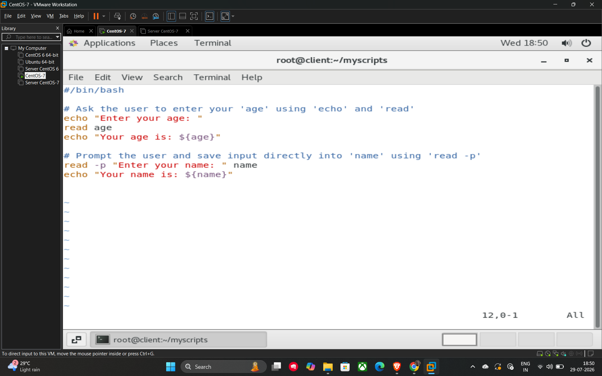

# User Interaction (Taking Input)

In shell scripting, you can make your scripts interactive by taking input directly from the user during execution. The primary command used for this is read.

## Basic Input

To capture user input and store it in a variable, use the following syntax:

* **read**: This waits for the user to type something and press Enter, then stores that value in the specified variable name.

## Providing a Prompt

There are two common ways to ask a user for information:

1. **Using echo and read:** Display a message first with echo and then capture the input on the next line.
2. **Using read -p:** This is a more concise method that displays a prompt message and captures the input on the same line.

---

## Example Script (06_user_interaction.sh)

Based on the lecture, here is how you implement these methods:

```bash
#!/bin/bash

# Method 1: Using 'echo' and 'read' separately
echo "Enter your age: "
read age
echo "Your age is: ${age}"

# Method 2: Using the -p flag to prompt and save input directly
read -p "Enter your name: " name
echo "Your name is: ${name}"
```


## Example



