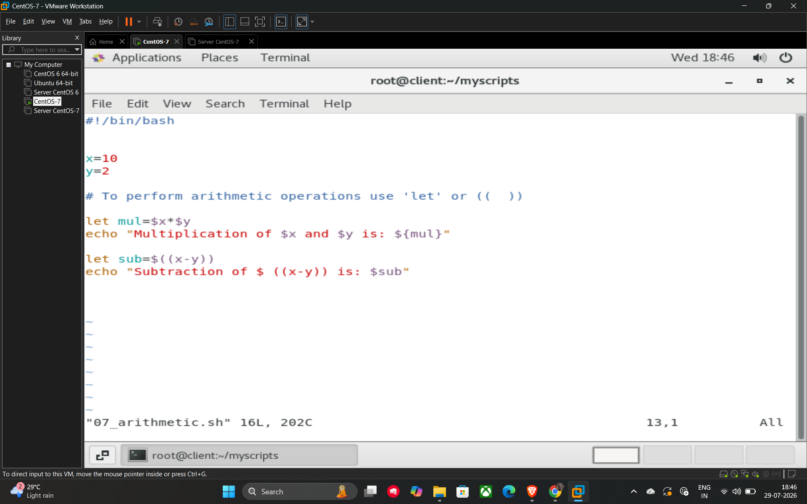

# Arithmetic Operations

In shell scripting, mathematical calculations are not performed automatically like in some other languages. You must explicitly use the **let** command or double parentheses **(( ))** to evaluate arithmetic expressions.

## Methods for Calculations

* **Using let:** This command allows you to perform operations and store the result in a variable.
* *Example:* `let a=5*10`
* **Using (( )):** This is a modern syntax for arithmetic that is often used for operations like incrementing variables or assignments within the parentheses.
* *Example:* `((a++))` or `((a=5*10))`

## Example Script (07_arithmetic.sh)

This script demonstrates how to perform multiplication and subtraction using these arithmetic methods:

```bash
#!/bin/bash

x=10
y=2

# To perform arithmetic operations use 'let' or (( ))

# Multiplication using 'let'
let mul=$x*$y
echo "Multiplication of $x and $y is: ${mul}"

# Subtraction using 'let' with arithmetic expansion
let sub=$((x-y))
echo "Subtraction of $((x-y)) is: $sub"
```

## Example


