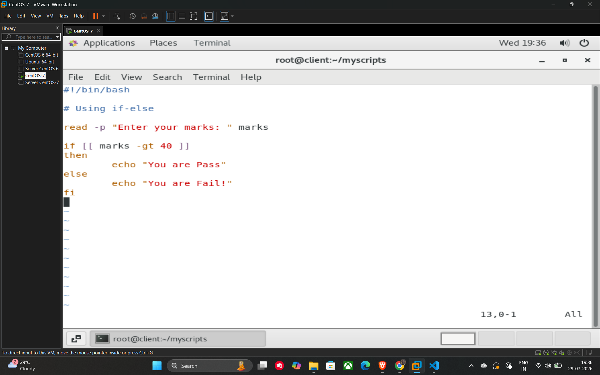

# Conditional Statements (If-Else)

Conditional statements allow your script to make decisions based on whether a specific condition is true or false.

## Basic Syntax

The most common conditional structure is the **if-else** block:

```bash
if [ condition ]
then
    # Code to execute if condition is true
else
    # Code to execute if condition is false
fi
```

The block starts with if and ends with fi (if spelled backwards)

## Comparison Operators

When using if-else statements, you often need to compare numeric values or strings. The following operators are commonly used in shell scripting:

| Operator | Description |
| --- | --- |
| -eq / == | Equal to |
| -ge | Greater than or equal to |
| -le | Less than or equal to |
| -ne / != | Not equal to |
| -gt | Greater than |
| -lt | Less than |

## Example Script (08_if_else.sh)

This script asks the user for their marks and determines if they have passed or failed based on a threshold of 40.

```bash
#!/bin/bash

# Using if-else to check passing marks

read -p "Enter your marks: " marks

if [[ $marks -gt 40 ]]
then
    echo "You are Pass"
else
    echo "You are Fail!"
fi
```

## Example


