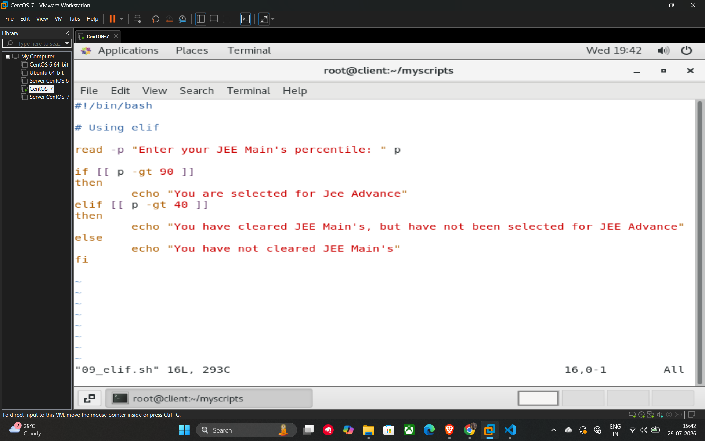

# Multiple Conditions (Elif)

The **elif** (short for "else if") statement is used when you need to check multiple conditions in a sequence. If the initial if condition is false, the shell evaluates the elif block. If that is also false, it can move to subsequent elif blocks or the final else statement.

## Basic Syntax

```bash
if [ condition1 ]
then
    # code for condition1
elif [ condition2 ]
then
    # code for condition2
else
    # code if none of the above are true
fi
```

## Example Script (09_elif.sh)

This script determines a student's qualification status based on their JEE Main's percentile using multiple conditions.

```bash
#!/bin/bash

# Using elif

read -p "Enter your JEE Main's percentile: " p

if [[ $p -gt 90 ]]
then
    echo "You are selected for Jee Advance"
elif [[ $p -gt 40 ]]
then
    echo "You have cleared JEE Main's, but have not been selected for JEE Advance"
else
    echo "You have not cleared JEE Main's"
fi
```

## Example


