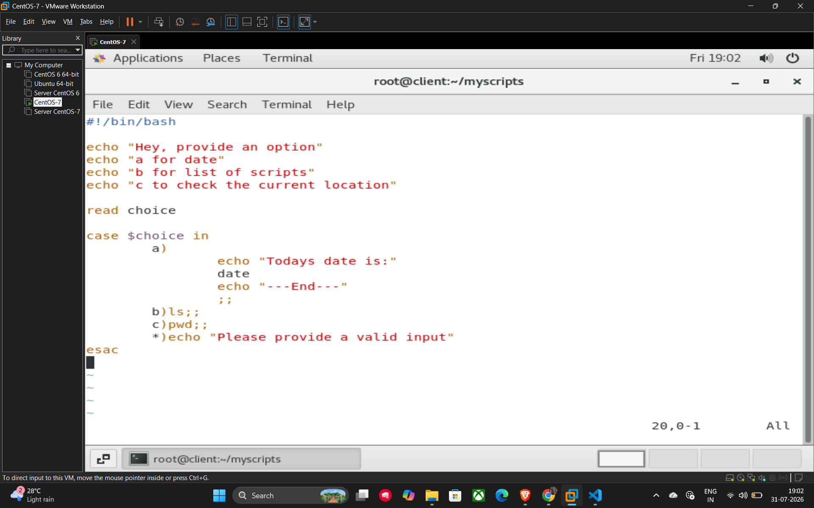

# 19. Case Statements

A **case** statement is used when you need to compare a single variable against multiple possible values. It is often a cleaner and more readable alternative to using multiple elif statements.

## Basic Syntax

The structure begins with case and ends with esac (case spelled backwards).

* **Patterns:** Each potential value is followed by a closing parenthesis `)`.
* **Execution:** The code block for a matching pattern executes until it hits a double semicolon `;;`, which acts as a terminator for that specific case.
* **Default Case:** The `*)` pattern acts as a wildcard or "default" case, executing if no other patterns match the input.

## Example Script (10_case.sh)

This script prompts the user to choose an option and performs different system commands based on that choice.

```bash
#!/bin/bash

echo "Hey, provide an option"
echo "a for date"
echo "b for list of scripts"
echo "c to check the current location"

read choice

case $choice in
    a)
        echo "Todays date is:"
        date
        echo "---End---"
        ;;
    b) ls;;
    c) pwd;;
    *) echo "Please provide a valid input"
esac
```

## Example


