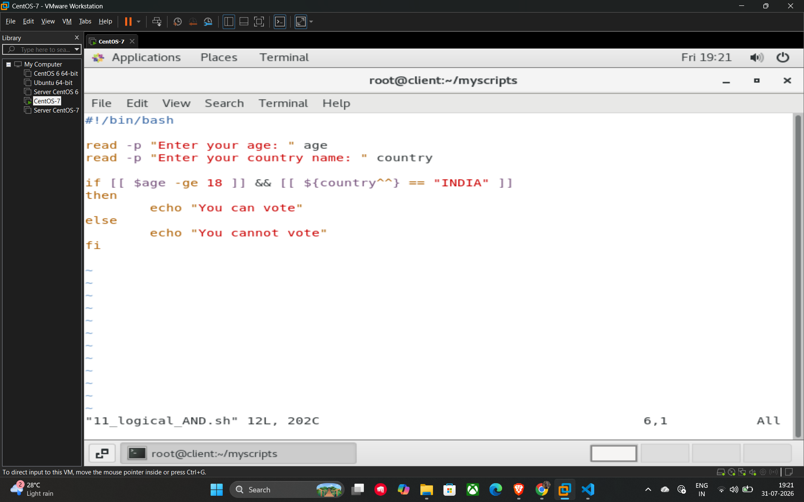
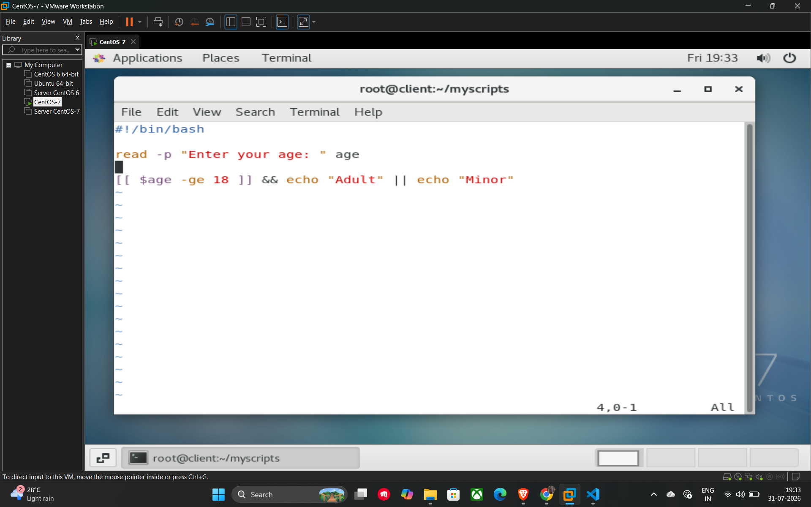

# 20. Logical Operators

Logical operators allow you to combine multiple conditions within a single if statement or command execution.

## Types of Logical Operators

* **AND (&&):** The combined condition is **true** only if **both** individual conditions are true.
* **OR (||):** The combined condition is **true** if **at least one** of the conditions is true.
* **NOT (!):** Used to reverse the logical state of a condition.

## Ternary-like Operations

In shell scripting, you can use a combination of `&&` and `||` to create a shorthand version of an if-else statement:

* **Syntax:** `condition1 && condition2 || condition3`
* **Behavior:** The shell will execute `condition2` only if `condition1` is true; otherwise, it will execute `condition3`.

## Example Scripts

### 1. Using AND (11_logical_AND.sh)

This script checks two conditions: the user must be at least 18 years old **and** from India to be eligible to vote.

```bash
#!/bin/bash

read -p "Enter your age: " age
read -p "Enter your country name: " country

# Both conditions must be true
if [[ $age -ge 18 ]] && [[ ${country^^} == "INDIA" ]]
then
    echo "You can vote"
else
    echo "You cannot vote"
fi
```

### 2. Shorthand Logic (One-liner)

This example demonstrates using the `&&` and `||` operators to print a result without a full if-else block.

```bash
#!/bin/bash

read -p "Enter your age: " age

# If age >= 18, print "Adult", else print "Minor"
[[ $age -ge 18 ]] && echo "Adult" || echo "Minor"
```

## Example


