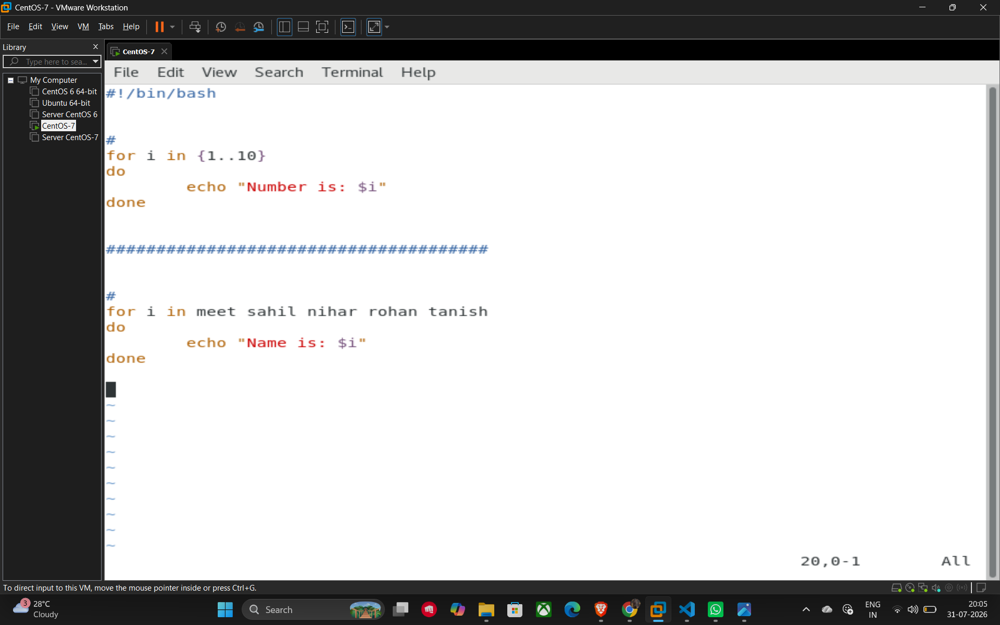
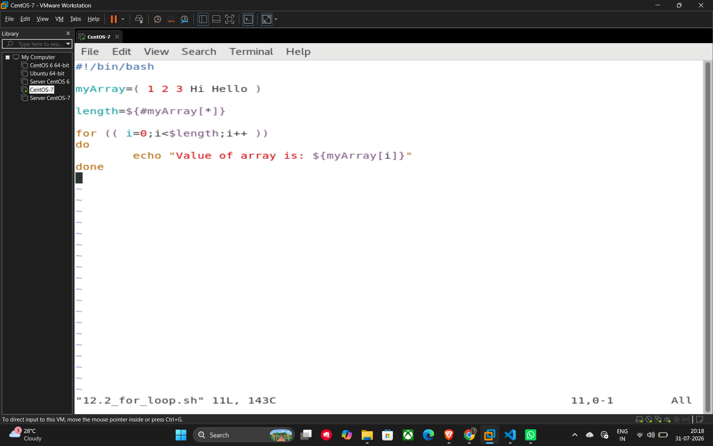
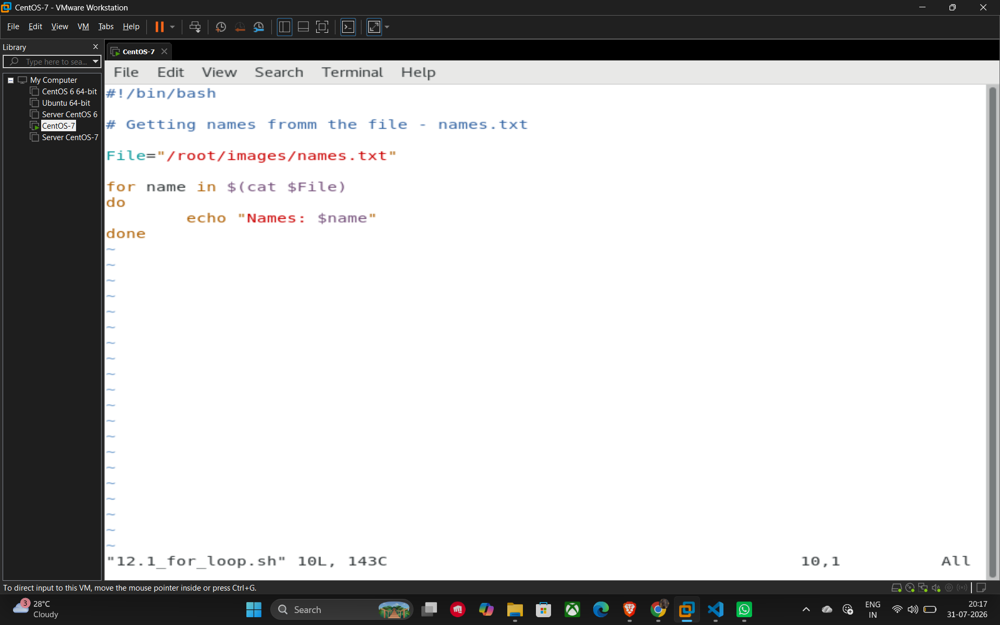

# 21. For Loops

**For loops** are used to iterate over a list of items, such as a sequence of numbers, a list of strings, or the contents of files and arrays.

## Basic Syntax and Simple Iteration

The most basic way to write a for loop is to list the items explicitly or use a range.

**1. Iterating over a list of numbers:**

```bash
for i in 1 2 3 4 5
do
    echo "Number is $i"
done
```

**2. Iterating over a list of strings:**

```bash
# Example from lecture slide
for j in Raju Sham Baburao
do
    echo "Name is $j"
done
```

```bash
# Example from terminal screenshot
for i in meet sahil nihar rohan tanish
do
    echo "Name is: $i"
done
```

**3. Using a numeric range {start..end}:**

```bash
for i in {1..10}
do
    echo "Number is: $i"
done
```

## Iterating Through Values from a File

You can use a for loop to read each word or line from a text file by using command substitution with the cat command.

**Example Script (12.1_for_loop.sh):**

```bash
#!/bin/bash

# Getting names from the file - names.txt
File="/root/images/names.txt"

for name in $(cat $File)
do
    echo "Names: $name"
done
```

## Iterating Through an Array

To iterate through an array using its index, you can use a **C-style for loop** syntax: (( initializer; condition; step )).

**Example Script (12.2_for_loop.sh):**

```bash
#!/bin/bash

# Define an array with different data types
myArray=( 1 2 3 Hi Hello )

# Get the length of the array
length=${#myArray[*]}

# Iterate using the index
for (( i=0; i<$length; i++ ))
do
    echo "Value of array is: ${myArray[i]}"
done
```

## Example



