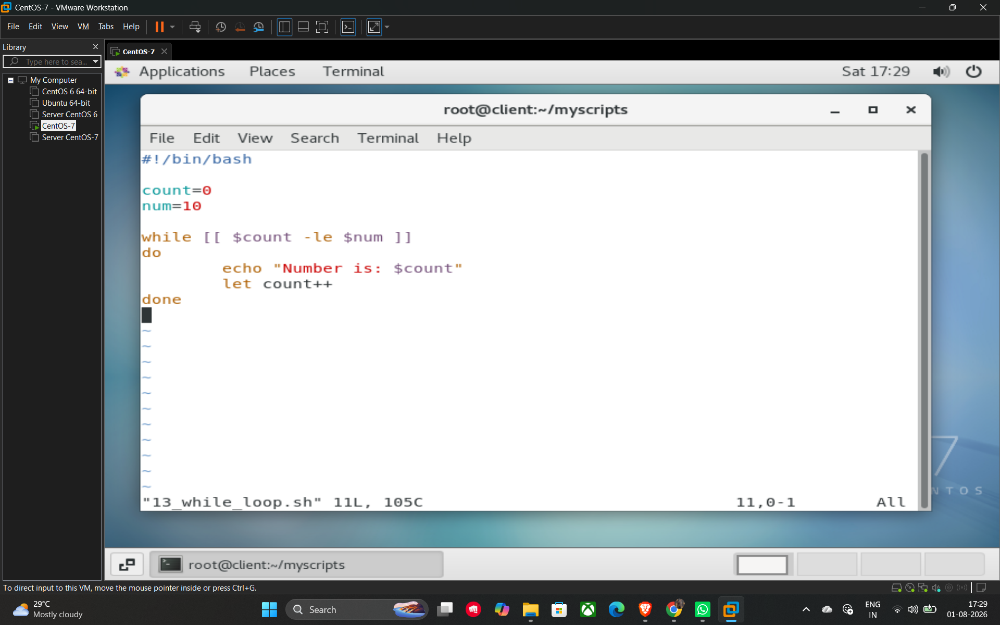

# While Loops

A **while loop** is used to repeatedly execute a block of commands as long as a specified condition remains true. Once the condition becomes false, the loop terminates and the script continues with the next command.

## Basic Syntax

The structure of a while loop begins with the while keyword followed by a condition in brackets, and concludes with done.

```bash
while [ condition ]
do
    # Commands to execute while the condition is true
done
```

## Example Script (13_while_loop.sh)

This script demonstrates a simple counter that prints numbers from 0 to 10 using a while loop.

```bash
#!/bin/bash

count=0
num=10

# The loop runs as long as count is less than or equal to num
while [ $count -le $num ]
do
    echo "Numbers are $count"

    # Increment the count variable to eventually end the loop
    let count++
done
```

## Key Components in the Example

* **Initialization:** count=0 sets the starting point.
* **Condition:** `[[ $count -le $num ]]` checks if the current count is less than or equal to 10.
* **Increment:** let count++ is crucial; without it, the condition would always be true, resulting in an infinite loop.

## Example



