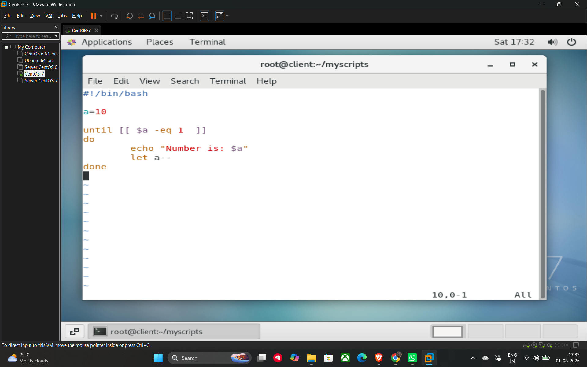

# Until Loops

An **until loop** is used to execute a block of commands repeatedly **until** a specified condition becomes true. It is essentially the opposite of a while loop; while a while loop runs as long as a condition is true, an until loop runs as long as the condition is **false** and terminates the moment it becomes true.

## Basic Syntax

```bash
until [ condition ]
do
    # Commands to execute until the condition is true
done
```

## Example Script (14_until_loop.sh)

This script demonstrates a countdown from 10 down to 1. The loop continues to execute as long as the variable a is not equal to 1.

**Method 1: Using let for decrementing**

```bash
#!/bin/bash

a=10

# The loop runs until a is equal to 1
until [[ $a -eq 1 ]]
do
    echo "Number is: $a"
    # Decrement the variable
    let a--
done
```

**Method 2: Using expr for decrementing**

In older shell scripts or specific environments, you might see the expr command used for arithmetic operations.

```bash
a=10

until [ $a -eq 1 ]
do
    echo $a
    # Using backticks and expr for subtraction
    a=`expr $a - 1`
done
```

## Key Logic

* **Condition:** `[[ $a -eq 1 ]]`. The loop checks if a is 1. Since it starts at 10 (false), the loop begins.
* **Execution:** It prints the current value of a and then subtracts 1.
* **Termination:** As soon as a reaches 1, the condition `[[ $a -eq 1 ]]` becomes **true**, and the loop stops.

## Example



