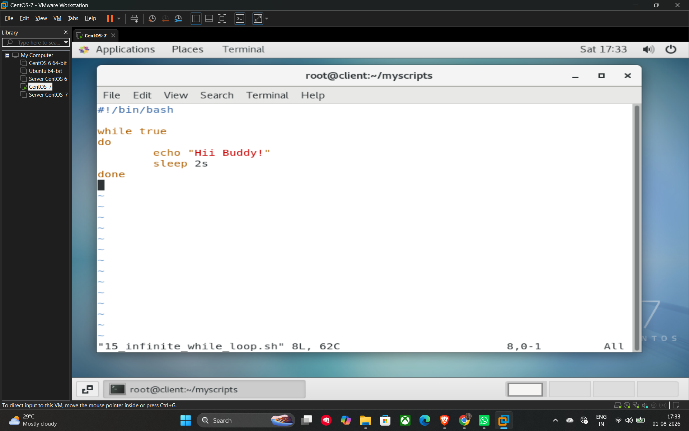

# 24. Infinite Loops

An **infinite loop** is a sequence of instructions in a computer program which loops endlessly, either because the loop has no terminating condition or because the condition can never be met. In shell scripting, these are often used for monitoring services or creating background processes that need to run continuously.

## Method 1: Using a while Loop

The most common way to create an infinite loop is by using while true. Since the condition true is always met, the code block will execute indefinitely until the script is manually stopped (e.g., using Ctrl+C).

**Example Script (15_infinite_while_loop.sh):**

```bash
#!/bin/bash

while true
do
    echo "Hii Buddy!"
    sleep 2s
done
```

## Method 2: Using a for Loop

You can also create an infinite loop using a C-style for loop syntax by leaving the initialization, condition, and increment fields empty.

**Example Script (15_infinite_for_loop.sh):**

```bash
#!/bin/bash

for (( ; ; ))
do
    echo "Hii Buddy!"
    sleep 1s
done
```

## Key Commands Used

* **sleep**: This command is used to pause the execution of the script for a specified amount of time.
* sleep 2s: Pauses for 2 seconds.
* sleep 1s: Pauses for 1 second.
* **Usage in Loops:** Adding a sleep command inside an infinite loop is highly recommended to prevent the script from consuming excessive CPU resources by running too fast.

## Example




