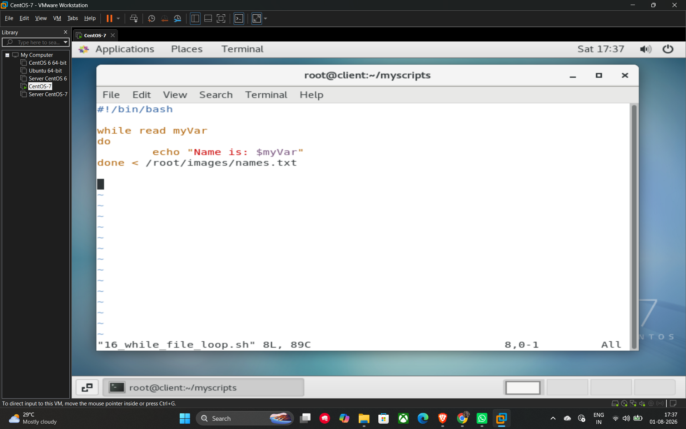

# Reading Content from a File (While Loop)

A common and efficient way to process the contents of a file line-by-line in shell scripting is by using a **while loop** combined with the read command.

## Basic Syntax

The loop reads each line from the file and stores it into a variable. The loop terminates automatically once the end of the file is reached.

```bash
while read variable_name
do
    # Commands to process each line
done < file_name
```

* **read variable_name**: This command reads a single line from the input and assigns it to the specified variable.
* **< file_name**: This uses **input redirection** to feed the content of the file into the while loop.

## Example Script (16_while_file_loop.sh)

This script demonstrates how to read names from a file located at a specific path and print them to the terminal.

```bash
#!/bin/bash

# The loop reads every line from names.txt until the end of the file
while read myVar
do
    echo "Name is: $myVar"
done < /images/names.txt
```

## Example


