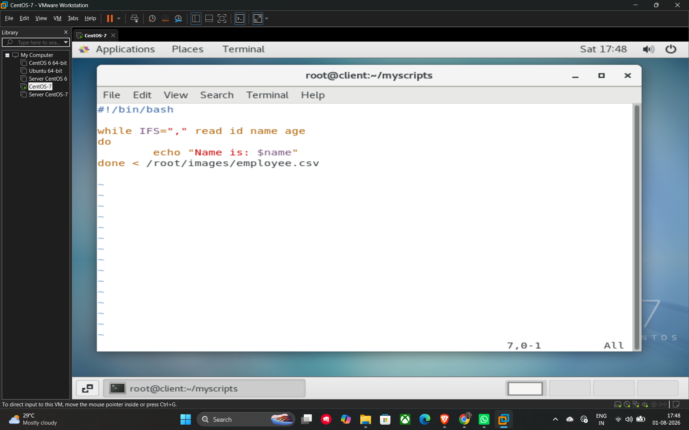
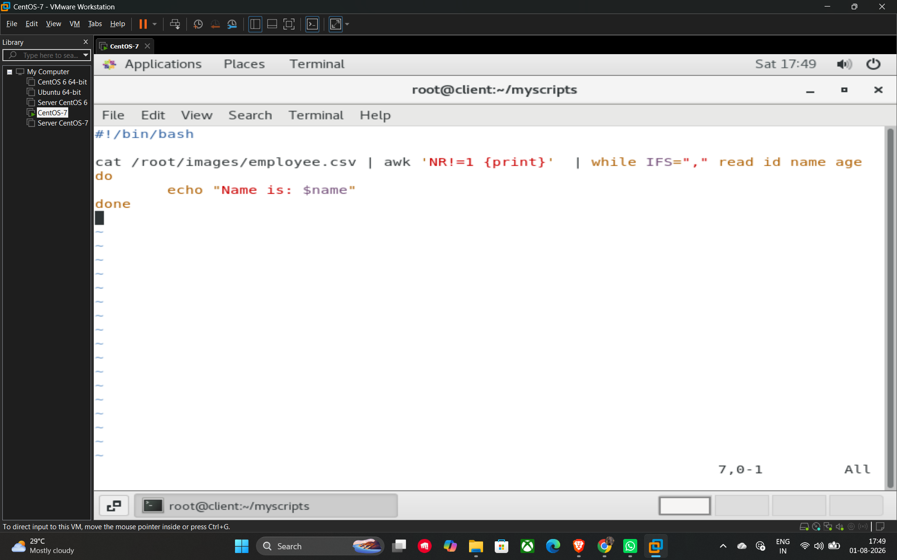

# 26. Reading Content from a CSV File

When working with CSV (Comma-Separated Values) files, you can use a **while loop** along with the **IFS** (Internal Field Separator) variable to parse and process data field by field.

## Method 1: Basic CSV Reading

By setting `IFS=","`, you tell the read command to split each line into variables based on the location of commas.

**Example Script:**

```bash
#!/bin/bash

# Reading from a CSV file and assigning columns to variables
while IFS="," read id name age
do
    echo "Name is: $name"
done < /images/employee.csv
```

## Method 2: Skipping the Header Line

Often, CSV files contain a header line (e.g., "ID, Name, Age") that you do not want to process as data. You can use the **awk** command to skip the first line before passing the content to the while loop.

* **awk 'NR!=1 {print}'**: This command tells the system to print every line *except* the first one (where the Number of Record NR is not 1) 3, 4.

**Example Script:**

```bash
#!/bin/bash

# Use awk to skip the header, then pipe the remaining data into the while loop
cat /images/employee.csv | awk 'NR!=1 {print}' | while IFS="," read id name age
do
    echo "Name is: $name"
done
```

## Key Components

* **IFS=","**: Temporarily sets the separator to a comma for the read command.
* **Multiple Variables**: You can list multiple variables (e.g., f1 f2 f3 or id name age) after the read command to capture different columns from the CSV.
* **Piping (|)**: Used in Method 2 to send the filtered output of awk directly into the loop.

## Example




