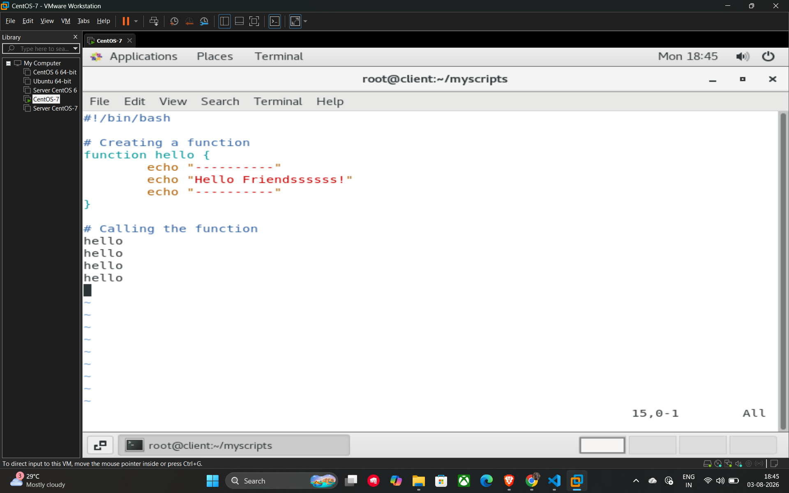
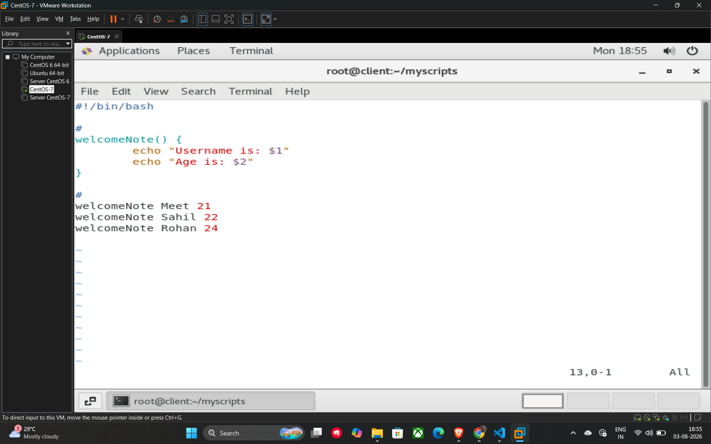

# 27. Functions in Shell Scripting

**Functions** are blocks of code that perform specific tasks and only run when they are called 1. They are essential for writing clean, efficient scripts because they allow you to reuse code multiple times, which reduces the overall number of lines in your program.

## Defining and Calling Functions

There are two common ways to define a function in a shell script 2:

* **Syntax 1:** `function function_name { ... }`
* **Syntax 2:** `function_name() { ... }`

To **call** a function, you simply use its name anywhere in the script after it has been defined.

**Example 1: Basic Function (from Screenshot 3)**

This script defines a function that prints a greeting and calls it four times.

```bash
#!/bin/bash

# Creating a function
function hello {
    echo "-----------"
    echo "Hello Friendsssss!"
    echo "-----------"
}

# Calling the function
hello
hello
hello
hello
```

## Using Arguments in Functions

You can make functions dynamic by passing **arguments** to them. Inside the function, these arguments are accessed using positional parameters like $1, $2, etc., representing the first, second, and subsequent values passed during the function call.

**Example 2: Function with Arguments (from Screenshot 4)**

This script defines a function that takes a name and an age as arguments.

```bash
#!/bin/bash

# Defining a function that accepts two arguments
welcomeNote() {
    echo "Username is: $1"
    echo "Age is: $2"
}

# Calling the function with different values
welcomeNote Meet 21
welcomeNote Sahil 22
welcomeNote Rohan 24
```

## Key Concepts

* **Reusability:** Functions allow you to write logic once and execute it many times.
* **Local Variables:** Within a function, you can use the local keyword (e.g., local num1=$1) to ensure a variable is only accessible inside that specific function, preventing it from affecting the rest of the script.

## Example




