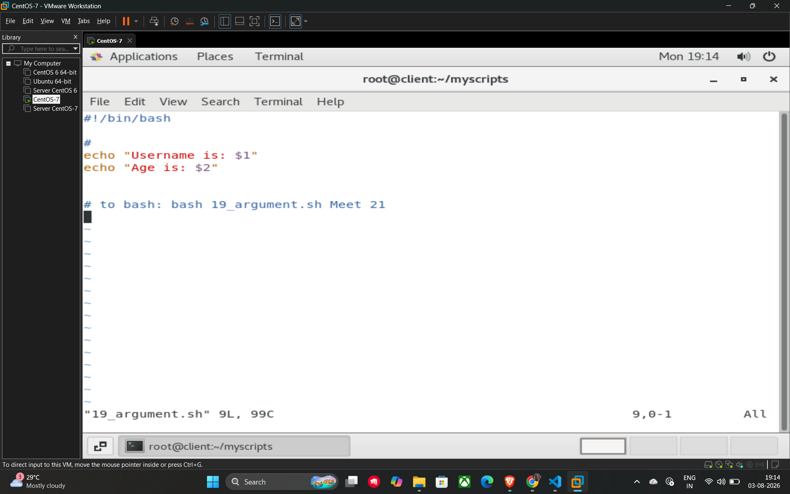
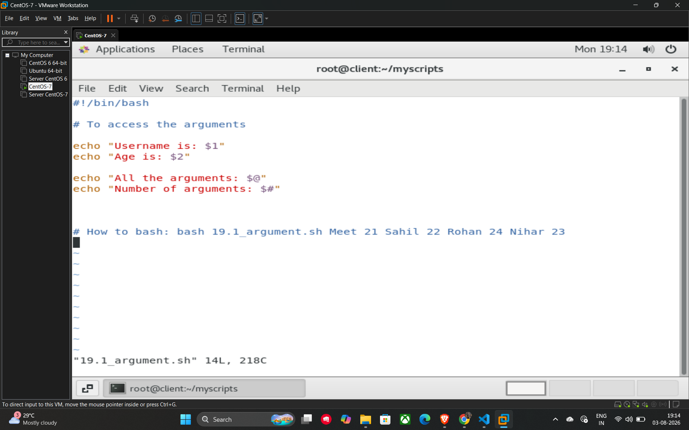
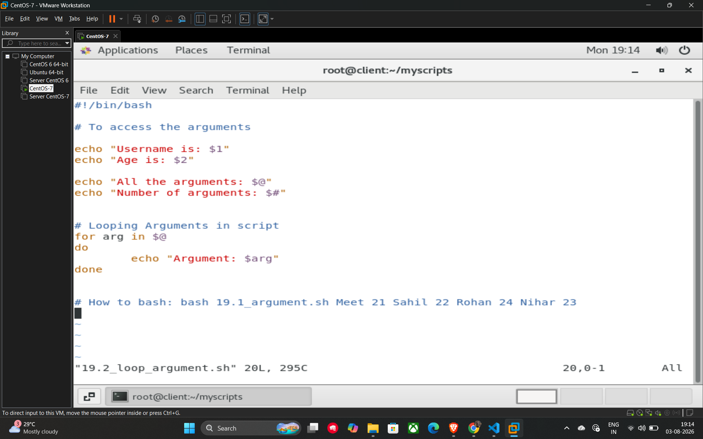
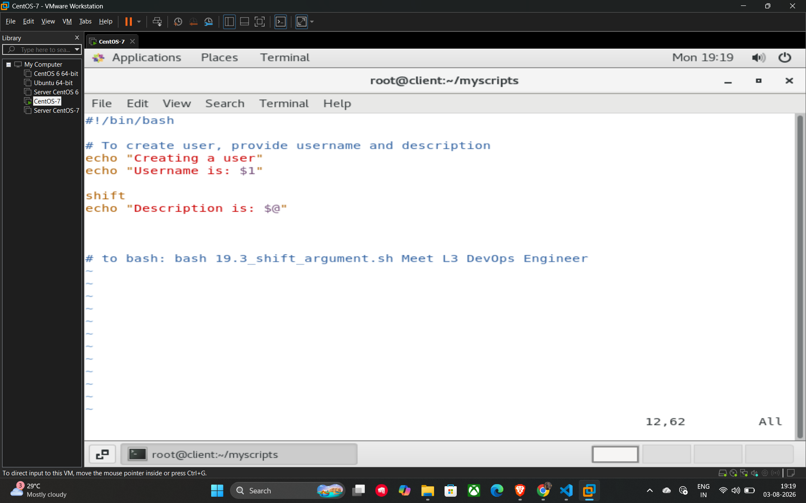

# 28. Arguments in Shell Scripts

**Arguments** are values you pass to a script when you execute it from the terminal. This makes your scripts more flexible by allowing them to process different data each time they run.

## Accessing Arguments

Inside a script, you can access these passed values using special variables called **positional parameters**.

* **Individual Arguments:** Use **$1**, **$2**, **$3**, etc., to access the first, second, and third arguments respectively.
* **Total Number of Arguments:** Use **$#** to get the count of how many arguments were provided.
* **All Arguments:** Use **$@** to display or use all the arguments passed to the script at once.

## Example Scripts

### 1. Basic Arguments (19_argument.sh)

This script accesses the first two arguments provided.

```bash
#!/bin/bash

echo "Username is: $1"
echo "Age is: $2"

# Execution: bash 19_argument.sh Meet 21
```

### 2. Accessing All Arguments (19.1_argument.sh)

This script demonstrates how to retrieve the total count and the full list of arguments 3.

```bash
#!/bin/bash

echo "Username is: $1"
echo "Age is: $2"

echo "All the arguments: $@"
echo "Number of arguments: $#"

# Execution: bash 19.1_argument.sh Meet 21 Sahil 22 Rohan 24 Nihar 23
```

### 3. Looping Through Arguments (19.2_loop_argument.sh)

You can use a **for loop** with the $@ variable to process each argument individually.

```bash
#!/bin/bash

# Looping through all provided arguments
for arg in $@
do
    echo "Argument: $arg"
done
```

## 29. Shifting Arguments

The **shift** command is used to move the positional parameters to the left.

## How Shift Works

When you call shift, the value originally in $2 moves to $1, the value in $3 moves to $2, and the original $1 is discarded. This is particularly useful when you want to extract a specific first argument and then treat all remaining arguments as a single group.

**Example Script (19.3_shift_argument.sh):**In this example, the script takes the first argument as the username and "shifts" the rest so they can all be captured together as a description using $@.

```bash
#!/bin/bash

# To create user, provide username and description
echo "Creating a user"
echo "Username is: $1"

# Shifting moves all subsequent arguments one position to the left
shift
echo "Description is: $@"

# Execution: bash 19.3_shift_argument.sh Meet L3 DevOps Engineer
# In this case, "Meet" is $1. After shift, "L3 DevOps Engineer" becomes $@
```

## Example





