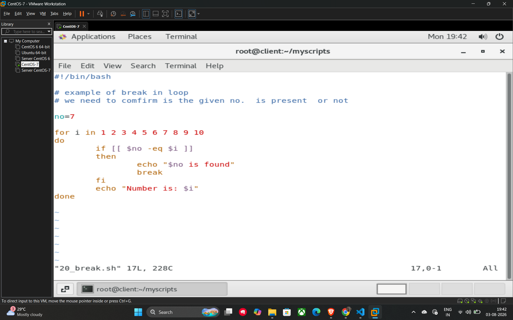

# 30. Break Statement

The **break** statement is used to terminate the execution of a loop (such as for, while, or until) prematurely. When the shell encounters a break command, it immediately exits the loop and continues with the next command in the script following the done keyword.

## Key Usage

It is commonly used when you are searching for a specific item or when a certain condition is met, and there is no longer a need to continue iterating through the remaining items.

## Example Script (20_break.sh)

This script demonstrates how to stop a loop early once a specific number is found.

```bash
#!/bin/bash

# Example of break in loop
# We need to confirm if the given no. is present or not

no=7

for i in 1 2 3 4 5 6 7 8 9 10
do
    # Check if current number matches our target
    if [[ $no -eq $i ]]
    then
        echo "$no is found"
        break  # Exits the loop immediately
    fi
    echo "Number is: $i"
done
```

## How the script works

1. The loop starts iterating from 1 to 10.
2. For numbers 1 through 6, the if condition is false, so it prints "Number is: $i".
3. When $i becomes 7, the condition `[[ $no -eq $i ]]` becomes true.
4. The script prints "7 is found" and then hits the **break** command.
5. The loop terminates instantly, so numbers 8, 9, and 10 are never processed or printed.

## Example



