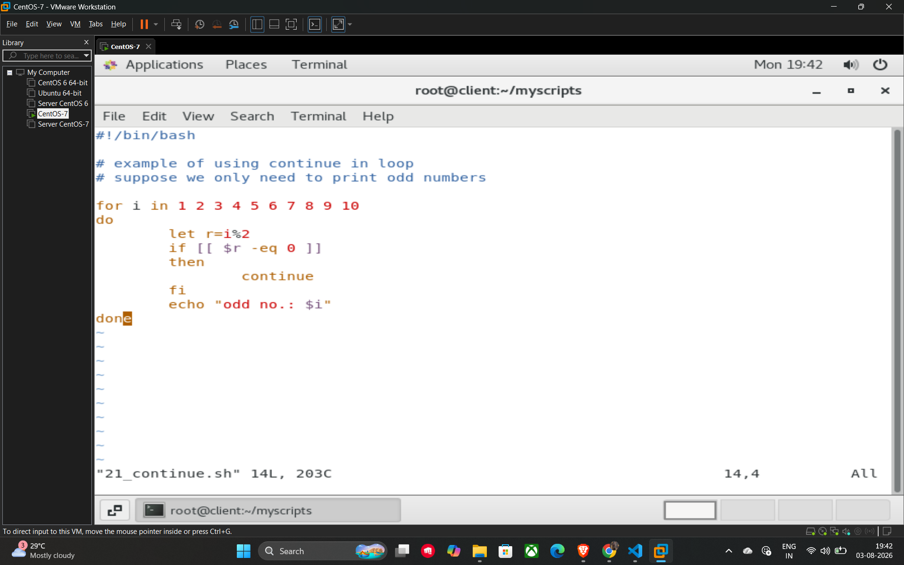

# 31. Continue Statement

The **continue** statement is used to skip the remaining commands within the current iteration of a loop and immediately move to the next iteration. While the break statement terminates the loop entirely, continue only stops the current "turn" and continues the loop from the next value.

## Key Usage

It is helpful when you want to bypass specific items in a list that do not meet your criteria while still processing the rest of the items in the loop.

## Example Script (21_continue.sh)

This script uses a for loop to iterate through numbers 1 to 10 but uses the continue statement to ensure only odd numbers are printed.

```bash
#!/bin/bash

# Example of using continue in loop
# Suppose we only need to print odd numbers

for i in 1 2 3 4 5 6 7 8 9 10
do
    let r=i%2
    if [[ $r -eq 0 ]]
    then
        # If the number is even (remainder is 0), skip to the next iteration
        continue
    fi
    echo "odd no.: $i"
done
```

## How the script works

* **Iteration:** The loop starts with i=1.
* **Logic Check:** It calculates the remainder of i divided by 2 (let r=i%2).
* **Condition:**
* If i is **even** (like 2, 4, 6...), the remainder r is 0. The if condition becomes true, and the **continue** command is executed. This skips the echo command and jumps directly back to the start of the loop for the next number.
* If i is **odd** (like 1, 3, 5...), the remainder is not 0. The if block is skipped, and the script prints "odd no.: $i".
* **Result:** The output will only display the odd numbers: 1, 3, 5, 7, and 9.

## Example



