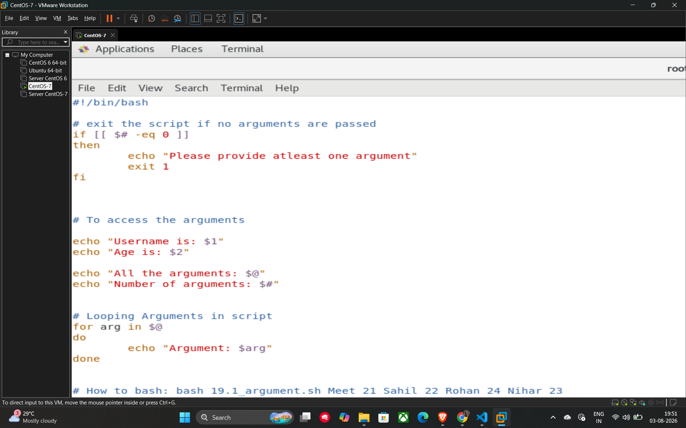

# 32. Validating Arguments and the Exit Command

It is a best practice to check if the necessary arguments have been provided before a script begins its main logic. This prevents the script from failing later due to missing data.

## Checking for Arguments

You can use the **$#** variable, which stores the total number of arguments, to verify if any values were passed to the script.

* **Validation Logic:** Using an if statement like if [[ $# -eq 0 ]] allows the script to detect when the argument count is zero.

## The exit Command

The **exit** command is used to stop the execution of a script immediately.

* **Error Handling:** By calling exit 1 after an error message, you signal to the system that the script terminated unsuccessfully.

## Comprehensive Example Script

This script combines argument validation, positional parameter access, and looping.

```bash
#!/bin/bash

# Exit the script if no arguments are passed
if [[ $# -eq 0 ]]
then
    echo "Please provide atleast one argument"
    exit 1
fi

# To access the arguments individually
echo "Username is: $1"
echo "Age is: $2"

# To access metadata about the arguments
echo "All the arguments: $@"
echo "Number of arguments: $#"

# Looping through all provided arguments
for arg in $@
do
    echo "Argument: $arg"
done

# How to run: bash script_name.sh Meet 21 Sahil 22 Rohan 24
```

## Example


