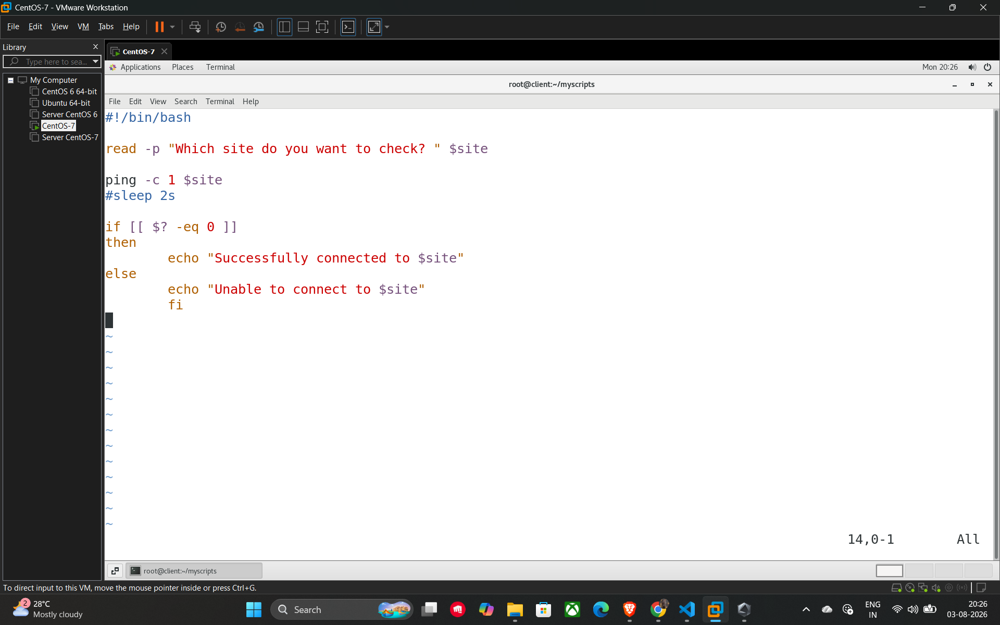

# 33. Connectivity Check and Exit Status ($?)

In shell scripting, every command returns an **exit status** (also known as a return code) when it finishes. The special variable **$?** captures the exit status of the most recently executed command, allowing you to check if it succeeded or failed.

## Understanding Exit Status

* **0**: Indicates the command was **successful**.
* **Non-zero**: Indicates the command **failed** or encountered an error.

## Example Script: Website Connectivity Check

This script demonstrates how to use the exit status to verify if a network connection to a specific website is active.

```bash
#!/bin/bash

# Prompt the user for the website they want to check
read -p "Which site do you want to check? " site

# Ping the site exactly once (-c 1)
ping -c 1 $site

# Check if the ping command was successful
if [[ $? -eq 0 ]]
then
    echo "Successfully connected to $site"
else
    echo "Unable to connect to $site"
fi
```

## Key Components

* **ping -c 1 $site**: Executes a ping request with a count of 1.
* **The $? Variable**: Immediately following the ping command, $? will hold 0 if the site responded and a non-zero value if it did not.
* **Conditional Logic**: The if-else block uses the value of $? to print a success or failure message based on the connectivity result.

## Example



