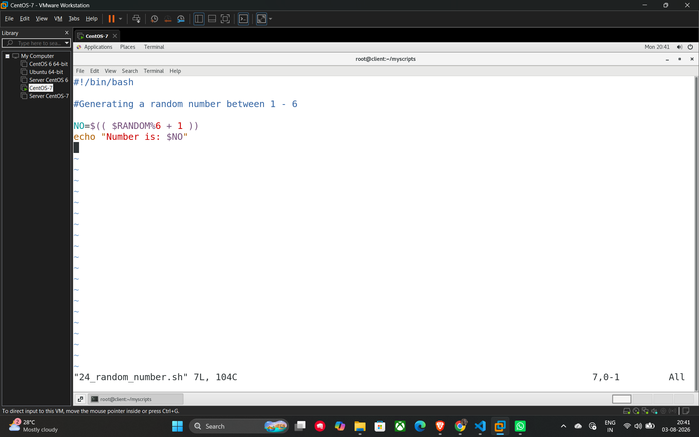

# 34. Generating Random Numbers

In shell scripting, you can use the built-in environment variable **$RANDOM** to generate a random integer. Each time this variable is referenced, it produces a different random number between 0 and 32767.

## Logic for Specific Ranges

To get a random number within a specific range (like 1 to 6), you use the modulo operator (%) and arithmetic expansion.

* **$RANDOM%6**: This returns a remainder between 0 and 5.
* **+ 1**: Adding 1 shifts the range to be between 1 and 6.

## Example Script (24_random_number.sh)

This script demonstrates how to generate and display a random number specifically between 1 and 6, similar to rolling a die.

```bash
#!/bin/bash

# Generating a random number between 1 - 6
NO=$(( $RANDOM%6 + 1 ))

echo "Number is: $NO"
```

## Key Components

* **$RANDOM**: The internal bash function that returns a random integer.
* **$(( ... ))**: The syntax used for performing arithmetic operations in a script.
* **Variable Assignment**: The result is stored in the variable NO and then printed using the echo command.

## Example



